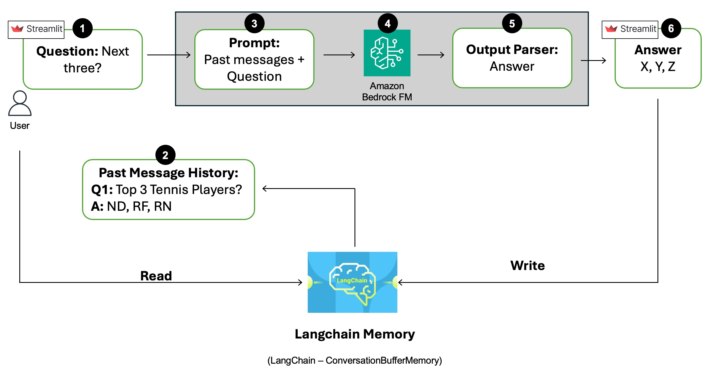
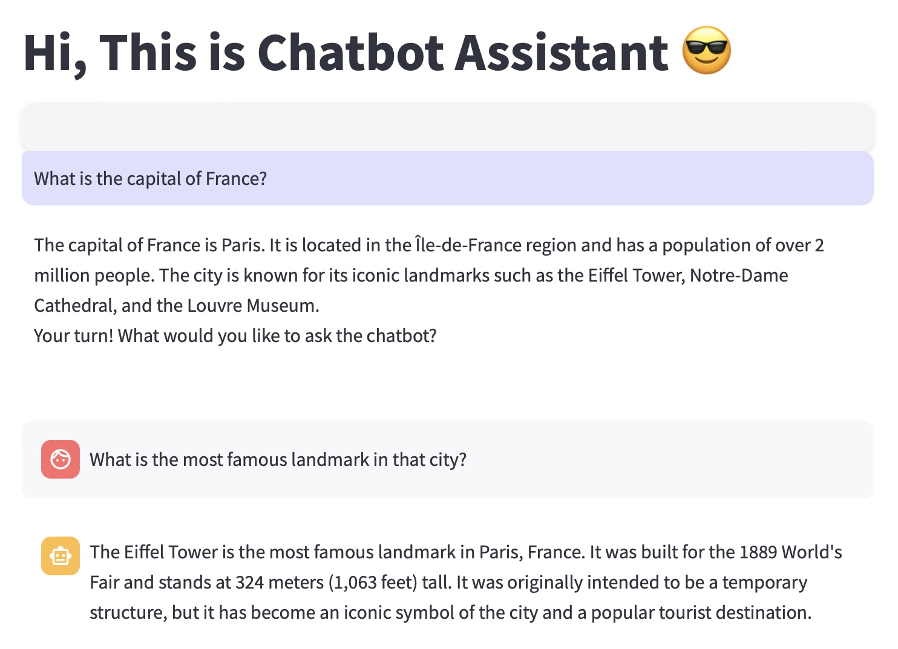

## Chatbot Powered by Amazon Bedrock, Llama 2 and Streamlit

This project demonstrates how to construct a chatbot leveraging Amazon Bedrock, the Llama 2 foundation model, LangChain, and Streamlit.

**Key Features**

* **Amazon Bedrock:**  Provides the knowledge base and integration for the foundation model.
* **Llama 2 Foundation Model:**  Supplies the core AI capabilities for natural language understanding and response generation.
* **LangChain:**  Manages conversational state, formats prompts for optimal responses, and links the chatbot components.
* **Streamlit:**  Creates a user-friendly frontend for interacting with the chatbot. 

## Architecture

The following diagram illustrates the architecture of the project:

## Components

The following components are involved in the project:

1. **User Input (Streamlit):** The user interacts with the chatbot through the Streamlit interface.
2. **LangChain Processing:**
   *  **Conversation Buffer Memory:** Stores the ongoing conversation history to maintain context. 
   *  **Prompt:** Formats the current query and conversation history into a prompt tailored for the Llama 2 foundation model.
   * **Conversation Chain:**  Connects the foundation model, memory, and prompt components.
3. **Amazon Bedrock and Llama 2:**  Processes the prompt, leverages the knowledge base, and generates a response using the Llama 2 model.
4. **LangChain Response Handling:** Formats the response for display and updates the conversation memory.
5. **Output (Streamlit):** The chatbot's response is presented to the user in the Streamlit interface.

**LangChain Modules**

* **Conversation Buffer Memory:** Enables thechatbot to track the discussion and understandthe context of follow-up questions.
* **Prompt Templates:** Structures prompts in away that maximizes the effectiveness of the Llama2 foundation model.
* **Conversation Chain:** Coordinates andcommunicates between LangChain modules and thefoundation model.

## Project Setup

**Backend implementation Steps (src/chatbot_backend.py):**

* Load the Amazon Bedrock LLM with the specified configuration.
* Create a ConversationBufferMemory object to manage the conversation history and token limit.
* Create a ConversationChain object to combine the LLM and the memory object for handling the conversation flow.
* To get the chat response, create a new conversation chain, generate a response using the run method of the conversation chain, and return the response. If there's an error, catch the exception, log the error, and return a default error message.

**Frontend Implementation Steps (src/app.py):**

* Add custom CSS styling for the chat container, user messages, and assistant messages.
* Set up the chatbot with an empty memory and chat history.
* Create a chat container and display the chat history.
* Implement the chat UI with a text input field for user input.
* Handle user input by appending it to the chat history and sending it to the chatbot for response generation.
* Display the chatbot's response in the chat container and append it to the chat history.

**Sample response:**

