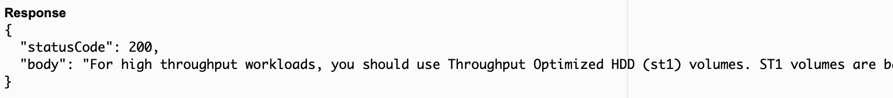

# Serverless E-Learning App using Amazon Bedrock Knowledge Base

## Overview of Amazon Bedrock Knowledge Base for RAG

Amazon Bedrock Knowledge Base is a service that simplifies the data ingestion workflow for building generative AI applications using Retrieval Augmented Generation (RAG). RAG combines retrieval and generation to improve the accuracy and relevance of answers to natural language questions.

## How it Works

The data ingestion workflow for RAG typically involves the following steps:

1. **Identify data source and load content:** Load the documents that contain the knowledge to be used by the RAG model into a data source.
2. **Transform data (chunking):** Break down the documents into smaller chunks, such as paragraphs or sentences.
3. **Create vector embeddings:** Convert the chunks into numerical representations called vector embeddings.
4. **Store vector embeddings:** Store the vector embeddings in a vector store or database.

Amazon Bedrock Knowledge Base automates these steps, making it easier to build RAG applications.

## Benefits of Using Amazon Bedrock Knowledge Base

Using Amazon Bedrock Knowledge Base offers several benefits:

- **Simplified data ingestion:** Automates the data ingestion workflow, reducing the time and effort required to prepare data for RAG models.
- **Support for multiple data sources and formats:** Supports loading data from S3 buckets and other data sources, and can handle various document formats such as PDFs and text files.
- **Choice of chunking strategies and embedding models:** Provides options for customizing the chunking strategy and selecting the embedding model to use.
- **Integration with Amazon OpenSearch and other vector stores:** Supports storing vector embeddings in Amazon OpenSearch Serverless Vector Store and other external vector stores.

## Project Details  

This project builds a serverless e-learning application that leverages a knowledge base, the Bedrock Claude Foundation model, AWS Lambda, and AWS API Gateway. The application is designed to support employees learning about AWS services in a large organization migrating its applications to AWS.

**Key Features**

* **Knowledge Base:**  Stores comprehensive AWS documentation in PDFs, providing the source material for the e-learning app.  
* **Claude Foundation Model:**  Provides intelligent responses to user queries by combining contextual information from the knowledge base with its own model's natural language processing capabilities.
* **AWS Lambda:**  Serves as the core compute logic, handling communication between API Gateway, the knowledge base, and the foundation model.
* **AWS API Gateway:**  Acts as the entry point for user questions, routing requests to the Lambda function. 

## Architecture

The following diagram illustrates the architecture of the project:


## Components

The following components are involved in the project:

1. **User Query:** An employee poses a question to the e-learning app (e.g., "Which EBS volume should I use for high IOPs?").
2. **AWS API Gateway:**  Receives the query and forwards it as an event to the AWS Lambda function.
3. **AWS Lambda:**  Invokes the Knowledge Base's Retrieve and Generate API, passing the user's prompt.
4. **Knowledge Base:** Extracts relevant context from the PDF documents in the S3 bucket.
5. **Claude Foundation Model:**  Processes the context and query, generating a comprehensive response. 
6. **AWS Lambda:** Relays the response back to the user via the API Gateway.

**Important Notes**

* **Region:** Use `us-east-1` for this service currently.
* **IAM User:**  Create an IAM user with admin access for setup (don't use the root account).
* **Costs:** The service incurs costs (around $0.50 - $1 per hour) mainly due to the OpenSearch serverless vector store.

## Project Setup

1. **Identify Data Source:**
   * Create an S3 bucket.
   * Upload relevant documents to the S3 bucket.

2.  **Create the Knowledge Base**
   * In the Amazon Bedrock console, navigate to Knowledge Base.
   * Click `Create Knowledge Base` and provide the following:
      * Name and description
      * Create a new IAM service role 
   * Select the S3 data source.
   * Use default chunking strategy.
   * Select Titan embeddings.
   * Use the default OpenSearch serverless vector store.
   * Review settings and click `Create Knowledge Base`.

3. **Sync the Knowledge Base**
   * Once the knowledge base is created, click `Sync` and wait for completion.

4. **Test the Knowledge Base**
   * Select the Anthropic foundation model. Example: `Claude Instant v1.2`.   
   * Ask questions related to your uploaded data. Example:          
   
         "Which EBS volume should I use for high throughput?"

**Amazon Bedrock APIs**

* **RetrieveAPI**
    * **Input:** User question as a prompt.
    * **Actions:** 
       * Converts the question into vector embeddings
       * Searches for similar content in the knowledge base.
       * Generates a context 
    * **Output:** Context relevant to the query.

* **RetrieveAndGenerateAPI**
    * **Input:** User question as a prompt.
    * **Actions:**
        * Queries the knowledge base (similar to `RetrieveAPI`)
        * Generates a response based on the search results
        * Can cite sources of the response 
    * **Output:**  A contextual answer to the user's question.

5. **Create Lambda Function**

    * Use [lambda_function.py](src/lambda_function.py) in the source folder for code.
    * This function takes a user's question, interacts with the Amazon Bedrock Knowledge Base using the `RetrieveAndGenerate API`, and provides a response based on the knowledge base and the selected foundation model.
    * Configuration -> Change time limit to 1 minutes.
    * Permissions -> Allow lambda exec role to be able to interact with Amazon Bedrock.
    * Check [retrieve_and_generate](https://boto3.amazonaws.com/v1/documentation/api/latest/reference/services/bedrock-agent-runtime/client/retrieve_and_generate.html) documentation for request and response parameters.
    * Following is the response for my test using this sample prompt. The response includes the source documents used to generate the response.

            Prompt: "Which EBS volume should I use for high    throughput?"

            Response: For high throughput workloads, you should use Throughput Optimized HDD (st1) volumes. ST1 volumes are backed by hard disk drives (HDDs) and are ideal for frequently accessed, throughput intensive workloads with large datasets and large I/O sizes. They deliver high throughput measured in MB/s, including the ability to burst up to 250 MB/s per TB."

         

   * Add `print(client_knowledgebase['citations'])` to the lambda function to print the sources used to generate the response.

          'location': {'type': 'S3', 's3Location': {'uri': 's3://<kb-demo-bucket>/Amazon EC2 FAQs.pdf'}}


6.  **API Gateway - Create API:**
    *   In the API Gateway console, create a new `REST API` (e.g., named "E-Learning Knowledge Base").

7.  **API Gateway - Create Method:**
    *   Add a `GET` method to your API `resource`.
    *   Link it to your existing Lambda function (ensure you've selected the correct region).

8.  **API Gateway - Configure Method Request:**
    *   Under Method Request settings: 
        *   Add a query string parameter named `prompt`.
        *   Enable `validate body request query string parameter and header`

9.  **API Gateway - Configure Integration Request:**
    *   Under Integration Request:
        *   Add a mapping template with the content type `application/json`.
        *   Use the following template body:
           ```json
            {
                "prompt": "$input.params('prompt')" 
            }
           ```
       *   **Important:** Ensure quotation marks are formatted correctly to avoid errors.

10.  **API Gateway - Deploy API:**
    *   Create a new API stage (e.g., `dev`)
    *   Deploy the API to this stage. Remember to redeploy after any changes!

11. **API Gateway - Usage**

*   Invoke the API endpoint using the following format. Replace `invoke-url` with the URL of your deployed API:

    `https://invoke-url?prompt=your_question_here`

   *  Example: 
     `https://invoke-url?prompt=Which%20is%20the%20best%20compute%20resource` 


**Important: Cleaning Up Resources**

To avoid ongoing costs, it's crucial to delete both your Amazon Bedrock Knowledge Base and the associated OpenSearch vector store:

1. **Delete Knowledge Base:** 
   * Navigate to the Amazon Bedrock console.
   * Select your Knowledge Base and click `Delete`.

2. **Delete OpenSearch Vector Store:**
   * Navigate to the Amazon OpenSearch Service console.
   * Locate the vector store created by your Knowledge Base (it will have a similar name).
   * Select the vector store and click `Delete`. Type `confirm` to complete the deletion.

**Remember:** Monitor your AWS charges to ensure no resources are unintentionally left running. 
