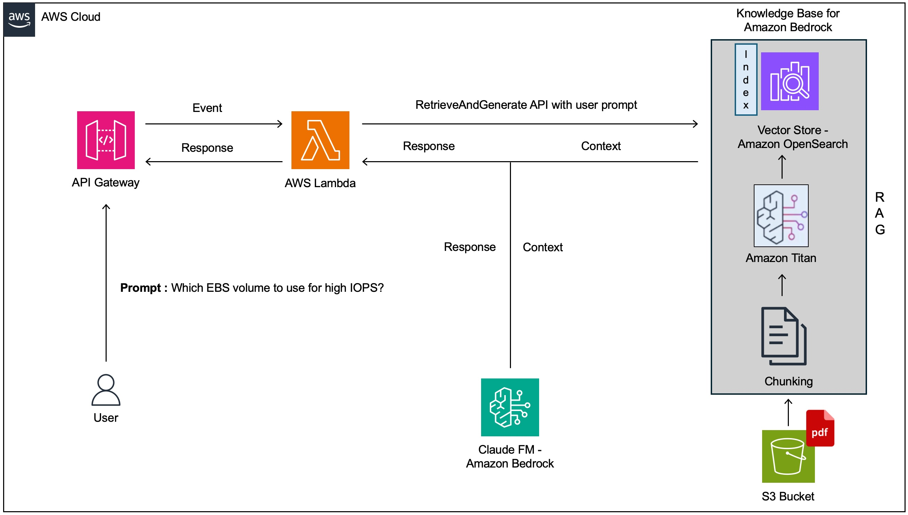

# Serverless E-Learning App using Amazon Bedrock Knowledge Base

## Overview of Amazon Bedrock Knowledge Base for RAG

Amazon Bedrock Knowledge Base is a service that simplifies the data ingestion workflow for building generative AI applications using Retrieval Augmented Generation (RAG). RAG combines retrieval and generation to improve the accuracy and relevance of answers to natural language questions.

## How it Works

The data ingestion workflow for RAG typically involves the following steps:

1. **Identify data source and load content:** Load the documents that contain the knowledge to be used by the RAG model into a data source.
2. **Transform data (chunking):** Break down the documents into smaller chunks, such as paragraphs or sentences.
3. **Create vector embeddings:** Convert the chunks into numerical representations called vector embeddings.
4. **Store vector embeddings:** Store the vector embeddings in a vector store or database.

Amazon Bedrock Knowledge Base automates these steps, making it easier to build RAG applications.

## Benefits of Using Amazon Bedrock Knowledge Base

Using Amazon Bedrock Knowledge Base offers several benefits:

- **Simplified data ingestion:** Automates the data ingestion workflow, reducing the time and effort required to prepare data for RAG models.
- **Support for multiple data sources and formats:** Supports loading data from S3 buckets and other data sources, and can handle various document formats such as PDFs and text files.
- **Choice of chunking strategies and embedding models:** Provides options for customizing the chunking strategy and selecting the embedding model to use.
- **Integration with Amazon OpenSearch and other vector stores:** Supports storing vector embeddings in Amazon OpenSearch Serverless Vector Store and other external vector stores.

## Project Details  

This project builds a serverless e-learning application that leverages a knowledge base, the Bedrock Cloud Foundation model, AWS Lambda, and AWS API Gateway. The application is designed to support employees learning about AWS services in a large organization migrating its applications to AWS.

**Key Features**

* **Knowledge Base:**  Stores comprehensive AWS documentation in PDFs, providing the source material for the e-learning app.  
* **Claude Foundation Model:**  Provides intelligent responses to user queries by combining contextual information from the knowledge base with its own model's natural language processing capabilities.
* **AWS Lambda:**  Serves as the core compute logic, handling communication between API Gateway, the knowledge base, and the foundation model.
* **AWS API Gateway:**  Acts as the entry point for user questions, routing requests to the Lambda function. 

## Architecture

The following diagram illustrates the architecture of the project:

## Components

The following components are involved in the project:

1. **User Query:** An employee poses a question to the e-learning app (e.g., "Which EBS volume should I use for high IOPs?").
2. **AWS API Gateway:**  Receives the query and forwards it as an event to the AWS Lambda function.
3. **AWS Lambda:**  Invokes the Knowledge Base's Retrieve and Generate API, passing the user's prompt.
4. **Knowledge Base:** Extracts relevant context from the PDF documents in the S3 bucket.
5. **Bedrock Cloud Foundation Model:**  Processes the context and query, generating a comprehensive response. 
6. **AWS Lambda:** Relays the response back to the user via the API Gateway.

