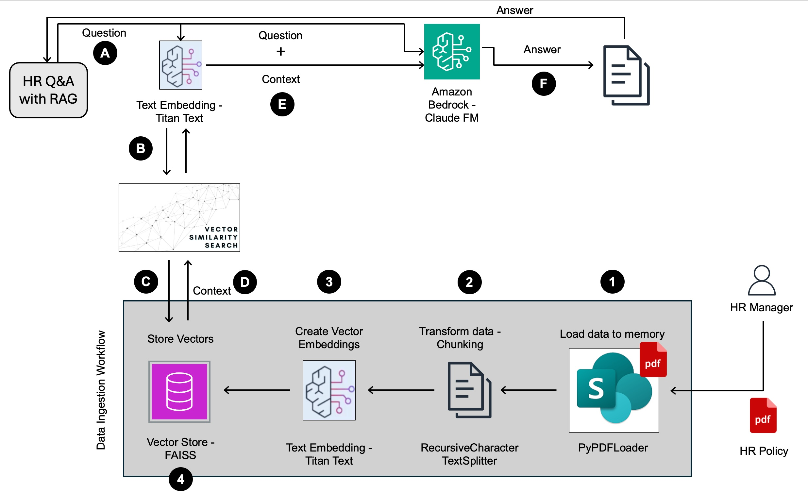

# HR Q&A Application with RAG

## Overview

This project demonstrates how to build an HR Q&A application using Retrieval Augmented Generation (RAG). RAG is a technique that combines retrieval and generation to improve the accuracy and relevance of answers to natural language questions.

## Architecture

The following diagram illustrates the architecture of the project:

## Components

The architecture of the application consists of the following components:

- **Data Ingestion Workflow:**
  - Loads PDF documents into memory using `PyPDFLoader` from Langchain.
  - Transforms data into chunks using `RecursiveCharacterTextSplitter` from Langchain.
  - Creates vector embeddings from chunks using Titan Text Embedding Model.
  - Stores vector embeddings in a vector store (e.g., FAISS).
  - Creates an index for easier search and retrieval.
- **User Interface:**
  - Allows users to ask questions.
- **Titan Text Embedding Model:**
  - Creates vector embeddings for user questions.
- **Vector Store:**
  - Stores vector embeddings of documents.
- **Amazon Bedrock Cloud Foundation Model:**
  - Receives user questions and context from the vector store.
  - Generates answers based on the input.

## How it Works

1. The user asks a question through the user interface.
2. The Titan Text Embedding Model creates a vector embedding for the question.
3. The vector embedding is used to search for similar documents in the vector store.
4. The context from the most similar document is retrieved.
5. The question and context are sent to the Amazon Bedrock Claude Foundation Model.
6. The foundation model generates an answer based on the input.
7. The answer is sent back to the user.

## Benefits of RAG

RAG offers several benefits over traditional question-answering approaches:

- **Improved accuracy and relevance:** By combining retrieval and generation, RAG can provide more accurate and relevant answers to user questions.
- **Scalability:** The data ingestion workflow can be scaled to handle large volumes of documents.
- **Flexibility:** RAG can be used with different foundation models and vector stores.