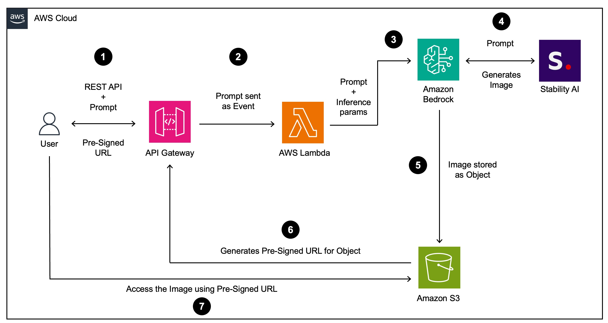

# AWS-GAI-StabilityAI-Poster: Movie Poster Design with Generative AI

## Project Overview

This project demonstrates the use of Generative AI for movie poster design.  It leverages AWS services alongside Stability AI's image generation capabilities to create the following workflow:

1. A user provides a text prompt describing the desired movie poster.
2. The prompt is processed through an API Gateway and a Lambda function.
3. AWS Bedrock interacts with the Stability AI foundation model to generate a unique image based on the prompt.
4. The generated poster is stored in an S3 bucket.
5. A pre-signed URL is provided to the user for accessing and sharing the poster.

## Architecture

The following diagram illustrates the architecture of the project:

## Components

The following components are involved in the project:

* **End User:** Initiates the process by sending a movie poster description (prompt) via a REST API call.
* **AWS API Gateway:** Serves as the entry point for API requests, routing them to the Lambda function. 
* **AWS Lambda Function:**  Handles the core logic:
    * Receives the prompt and any inference parameters.
    * Interacts with AWS Bedrock to trigger image generation.
    * Retrieves the image from S3.
    * Generates a pre-signed URL for secure access.
    * Returns the pre-signed URL to the API Gateway.
* **AWS Bedrock:** Interacts with the Stability AI foundation model for image generation.
* **Stability AI Foundation Model:** The generative AI model responsible for creating the movie poster based on the provided prompt.
* **Amazon S3 Bucket:** Stores the generated movie poster image. 
* **Pre-signed URL:** A temporary, shareable URL that grants access to the movie poster in S3.
