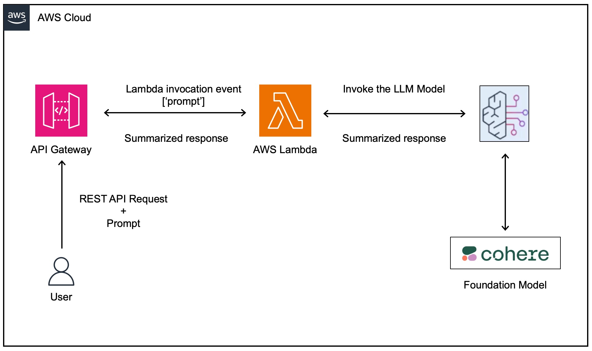

# AWS-GAI-Summarize: Text Summarization for Manufacturing Issue Resolution

## Project Overview

This project streamlines issue resolution processes for manufacturers of large equipment.  It harnesses Generative AI to summarize lengthy incident reports and related data, allowing equipment experts (SMEs) to make faster, more informed decisions.

**Problem:** Incident reports in the manufacturing industry can be extensive, making it time-consuming for SMEs to diagnose and resolve equipment issues.

**Solution:**  A text summarization solution powered by foundation models reduces the time SMEs spend reviewing reports, improving response times and overall productivity.

## Use Case: Large Turbine Manufacturer

1. A technician at a remote turbine site creates a detailed incident report with images.
2. The report is submitted to a custom application.
3. An equipment SME reviews the report to determine the root cause and provide a solution. 
4. The Generative AI summarization solution condenses the incident report, aiding the SME's diagnosis.

## Architecture

The following diagram illustrates the architecture of the project:



## Components

The following components are involved in the project:

* **User:** Initiates analysis by sending the incident report and relevant data as a prompt via a REST API call.
* **AWS API Gateway:** Receives incoming API requests, routing them to the Lambda function.
* **AWS Lambda Function:**  Core logic for the application:
    * Receives the prompt.
    * Interacts with AWS Bedrock to facilitate summarization.
    * Returns the summarized report to the API Gateway.
* **AWS Bedrock:** Interfaces with the Cohere foundation model for text summarization.
* **Cohere Foundation Model:** The generative AI model responsible for generating concise equipment issue summaries.

## Project Setup

**1. Create Function**

Navigate to AWS Lambda and create a new function (e.g., `DemoManufacturing`) with `Python 3.12` runtime.

**2. Verify Boto3 Version**

* **Import and Print Version:**  Import the `boto3` library within your function's code and check the version.
* **Upgrade if Necessary:** If the version is below `1.28.63`,  you'll need to create a Lambda layer to upgrade Boto3 to the latest version.

**3. Prepare Lambda Layer (if needed)**

* **Obtain ARN:**  If you created a Lambda layer to upgrade Boto3, retrieve its ARN (Amazon Resource Name).
* **Add Layer to Function:** In your Lambda function's settings, add the layer using the ARN.

**5. Test Boto3 Version**

* **Retest:** Run your Lambda function again to verify that the Boto3 version is now above `1.28.63`. 

**6. Create IAM Role for Lambda**

* Navigate to the AWS Lambda console.
* Open the configuration for the Lambda function.
* In the permissions section, attach the **AmazonBedrockFullAccess** policy.
* Increase the timeout under **General Configuration**. A good starting point is 1 minute and 3 seconds.

**7. Code Bedrock Invocation**

Check [lambda_function.py](src/lambda_function.py) for full code. Details of the important parts of the code are as follow:.

* Prepare the request syntax according to [documentation](https://boto3.amazonaws.com/v1/documentation/api/latest/reference/services/bedrock-runtime/client/invoke_model.html):

   ```python
   client_bedrock_request = client_bedrock.invoke_model(
       body=json.dumps({
           "prompt": input_prompt,
           "temperature": 0.9,
           "top_p": 0.75, 
           "max_tokens": 100
       }),
       content_type='application/json',
       accept='application/json',
       model_id='<your-bedrock-model-id>' 
   )
   ```
 * Retrieve, parse, and format the response:
   ```python
   client_bedrock_byte = client_bedrock_request["body"].read()
   client_bedrock_string = json.loads(client_bedrock_byte)
   client_final_response = client_bedrock_string['generations'][0]['text']
   ```
* Return the final response:
   ```python
   return client_final_response
   ```

**Important Notes:**

* You'll need a valid Bedrock Model ID – get this from the Bedrock console.
* Adjust parameters like `temperature`, `top_p` and `max_tokens` as needed. 
* You may need to add error handling to your code for production use. 


**8. Create an API and Resource**

* Navigate to the AWS API Gateway console
* Click `Create API` and choose `Rest API`
* Give your API a descriptive name (e.g., `DemoManufacturingAPI`)
* Create a resource within the API (e.g., `DemoManufacturing`) 

**9. Create a POST Method**

* Select the resource you just created
* Click `Create Method` and choose `POST` 
* Set the Integration type to `Lambda Function`
* Enter the name of your existing Lambda function 

**10. Configure the Method Request**

* Open the `Method Request" settings
* Under `URL Query String Parameters`, add a new parameter named `prompt` and mark it as `Required`

**11. Configure the Integration Request**

* Open the `Integration Request` settings
* Under `Mapping Templates`, add a new template with the Content-Type `application/json`
* Paste the following template code, replacing placeholders as needed:

```json
{ 
  "prompt": "$input.params('prompt')" 
}
```

**12. Deploy the API**

* Click `Actions` and select `Deploy API`
* Create a new stage (e.g., `dev`) and deploy

**13. Test**

* Access the API endpoint (find this under the `stages` section of your API )
* Use the query string parameter `prompt` to provide input to your Lambda function (e.g., `?prompt=What is your name?`) 

* Sample Prompt for testing:

    ```
    Summarize following text in 2 lines.

    This is a on-site log report of turbine breakdown.

    Issue Log Date - 25-12-2023, 
    Model Number - TB-CL-7882, 
    Issue - Cracks appeared in the part MR 7882-9571 next to the rotor  hub. The nut connecting the rotor blade to the rotor hub seems to be     damaged. The Anemometer readings seem to be within range. The   electric braking seems to be unused. No indication of damage to any   other component of the turbine except normal wear and tear.
    Potential Root Cause - Seems due to reduced tensile strength of the     nut connecting the blade to the rotor.
    Last Maintenance Date - 12-12-2023, Last Maintenance Issues Recorded - No known issues recorded and all the parameters were within range.
    ```
* Testing with Postman:

    - Use the API endpoint (created in previous steps) as the URL
    - Set method to `POST`
    - Use `prompt`as key for query params, and above sample prompt for `value`.
    - Click `Send`

* Following is the response for my test using this sample prompt:

    ```
    The log reports that the turbine model # TB-CL-7882 has a issue with cracks appearing due to reduced tensile strength of the nut connecting the rotor blade, with no other damage noted except normal wear and tear. The last maintenance was recorded as 12-12-2023 with no issues recorded.

    ```